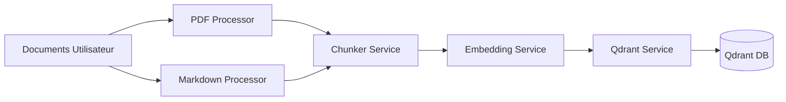
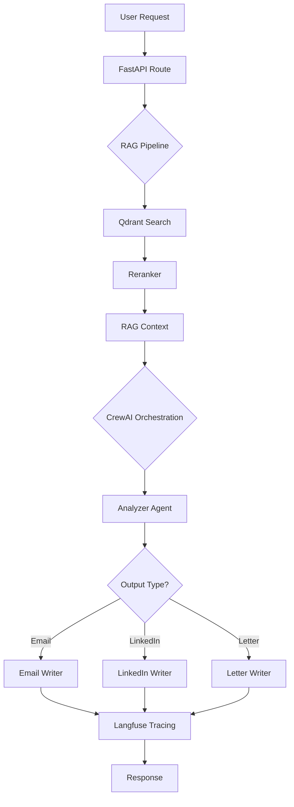

# 🏗️ Architecture JobBooster

## 📐 Principes de Conception

### SOLID
- **Single Responsibility** : Chaque module a une responsabilité unique
- **Open/Closed** : Extension sans modification via interfaces
- **Liskov Substitution** : Services interchangeables via abstractions
- **Interface Segregation** : Interfaces spécifiques et ciblées
- **Dependency Inversion** : Dépendances via abstractions

### Clean Architecture
- **Séparation des couches** : Core → Services → API → Agents
- **Indépendance des frameworks** : Business logic isolée
- **Testabilité** : Chaque couche testable indépendamment

## 🗂️ Structure Backend

```
backend/
├── app/
│   ├── core/                    # Configuration & utilitaires de base
│   │   ├── config.py           # Settings Pydantic
│   │   └── logging.py          # Structured logging (structlog)
│   │
│   ├── services/               # Logique métier (Singleton pattern)
│   │   ├── embeddings.py      # Service embeddings (HuggingFace)
│   │   ├── qdrant_service.py  # Service Qdrant (RAG)
│   │   ├── reranker.py        # Service reranking
│   │   ├── chunker.py         # Service chunking documents
│   │   └── langfuse_service.py # Service observabilité
│   │
│   ├── agents/                # Agents CrewAI (YAML-based)
│   │   ├── config/
│   │   │   ├── agents.yaml    # Définitions agents
│   │   │   └── tasks.yaml     # Définitions tâches
│   │   └── crews/
│   │       └── job_application_crew.py  # Crew orchestrator
│   │
│   ├── models/                # Schémas Pydantic
│   │   └── schemas.py         # Request/Response models
│   │
│   ├── api/                   # Routes FastAPI
│   │   └── routes.py          # Endpoints HTTP
│   │
│   └── main.py                # Point d'entrée FastAPI
│
├── scripts/                   # Scripts utilitaires
│   ├── ingest/
│   │   ├── pdf_processor.py          # Processeur PDF
│   │   ├── markdown_processor.py     # Processeur Markdown
│   │   └── ingestion_pipeline.py     # Pipeline orchestration
│   └── ingest_data.py         # Script principal d'ingestion
│
├── data/                      # Données utilisateur (non versionnées)
│   ├── cv.pdf
│   ├── linkedin.pdf
│   ├── dossier_competence.md
│   └── informations.md
│
├── pyproject.toml            # Dépendances Poetry
└── Dockerfile                # Image Docker
```

## 🔄 Flux de Données

### 1. Ingestion (Pipeline)



**Classes impliquées** :
- `IngestionPipeline` : Orchestrateur principal
- `PDFProcessor` : Traitement PDF (pymupdf4llm)
- `MarkdownProcessor` : Traitement Markdown (LangChain)
- `ChunkerService` : Découpage documents
- `EmbeddingService` : Génération embeddings
- `QdrantService` : Stockage vectoriel

### 2. Génération (Runtime)



**Classes impliquées** :
- `GenerateRequest` : Schéma requête (Pydantic)
- `QdrantService` : Recherche vectorielle
- `RerankerService` : Reranking résultats
- `JobApplicationCrew` : Orchestration CrewAI
- `LangfuseService` : Observabilité
- `GenerateResponse` : Schéma réponse

## 🤖 Architecture CrewAI (YAML-based)

### Configuration Agents (`agents.yaml`)

```yaml
analyzer:
  role: "Analyste d'Offres d'Emploi Senior"
  goal: "Extraire infos clés de l'offre"
  backstory: "Expert RH 15 ans d'expérience"
  llm: openai/gpt-4o-mini

email_writer:
  role: "Rédacteur d'Emails"
  llm: openai/gpt-4o-mini

linkedin_writer:
  role: "Spécialiste Messages LinkedIn"
  llm: google/gemini-1.5-pro

letter_writer:
  role: "Rédacteur de Lettres"
  llm: openai/gpt-4o-mini
```

### Configuration Tâches (`tasks.yaml`)

```yaml
analyze_offer:
  description: "Analyser l'offre : {job_offer}"
  expected_output: "JSON structuré avec infos clés"
  agent: analyzer

write_email:
  description: "Rédiger email basé sur {analysis} et {rag_context}"
  expected_output: "Email 150-200 mots"
  agent: email_writer
  context: [analyze_offer]
```

### Orchestration (`JobApplicationCrew`)

```python
@CrewBase
class JobApplicationCrew:
    agents_config = "app/agents/config/agents.yaml"
    tasks_config = "app/agents/config/tasks.yaml"

    @agent
    def analyzer(self) -> Agent:
        return Agent(config=self.agents_config["analyzer"])

    @task
    def analyze_offer_task(self) -> Task:
        return Task(config=self.tasks_config["analyze_offer"])

    def build_crew_for_output(self, output_type: str) -> Crew:
        # Construction dynamique selon output_type
```

**Avantages** :
- ✅ Configuration déclarative (YAML)
- ✅ Facile à maintenir et modifier
- ✅ Pas de recompilation nécessaire
- ✅ Versionnable et lisible
- ✅ Séparation configuration/logique

## 📊 Services (Singleton Pattern)

### EmbeddingService
```python
_embedding_service: EmbeddingService | None = None

def get_embedding_service() -> EmbeddingService:
    global _embedding_service
    if _embedding_service is None:
        _embedding_service = EmbeddingService()
    return _embedding_service
```

**Rôle** :
- Chargement modèle `intfloat/multilingual-e5-base`
- Génération embeddings textes
- Cache du modèle en mémoire

### QdrantService
**Rôle** :
- Connexion Qdrant
- Gestion collection `user_info` (cluster: `jobbooster`)
- Recherche vectorielle avec seuil de similarité
- Upsert de documents

### RerankerService
**Rôle** :
- Modèle `bclavie/bge-reranker-v2-m3`
- Reranking sémantique des résultats RAG
- Amélioration de la précision

### LangfuseService
**Rôle** :
- Tracing LLM calls
- Métriques de coûts et performance
- Observabilité complète

## 🔐 Configuration (Pydantic Settings)

```python
class Settings(BaseSettings):
    # API
    api_title: str
    debug: bool

    # LLM
    openai_api_key: str
    google_api_key: str

    # Qdrant
    qdrant_url: str
    qdrant_collection: str = "user_info"
    qdrant_cluster: str = "jobbooster"

    # Models
    embedding_model: str = "intfloat/multilingual-e5-base"
    reranker_model: str = "bclavie/bge-reranker-v2-m3"
```

**Chargement** : Variables d'environnement `.env`

## 🧪 Tests & Qualité

### Outils
- **pytest** : Tests unitaires
- **black** : Formatage code
- **ruff** : Linting
- **mypy** : Type checking (strict mode)

### Structure tests (à implémenter)
```
tests/
├── unit/
│   ├── test_services/
│   ├── test_agents/
│   └── test_models/
├── integration/
│   └── test_api/
└── conftest.py
```

## 📦 Déploiement

### Docker Compose
```yaml
services:
  qdrant:        # Port 6333/6334
  langfuse-db:   # PostgreSQL
  langfuse:      # Port 3001
  backend:       # Port 8000 (FastAPI)
```

### Production
- **Backend** : Railway/Render + Qdrant Cloud
- **Frontend** : Vercel
- **Monitoring** : Langfuse Cloud

## 🔄 Évolutivité

### Ajout d'un nouvel agent
1. Définir dans `agents.yaml`
2. Ajouter tâche dans `tasks.yaml`
3. Créer méthode `@agent` et `@task`
4. Modifier `build_crew_for_output()`

### Ajout d'une nouvelle source
1. Créer processor dans `scripts/ingest/`
2. Ajouter méthode dans `IngestionPipeline`
3. Appeler dans `collect_all_documents()`

### Ajout d'un nouveau LLM
1. Ajouter clé API dans `Settings`
2. Instancier LLM dans `JobApplicationCrew.__init__()`
3. Référencer dans `agents.yaml` : `llm: provider/model`

## 🎯 Patterns & Best Practices

### ✅ Utilisé
- **Singleton** : Services (embeddings, qdrant, reranker)
- **Factory** : Création dynamique de Crews
- **Strategy** : Choix du writer selon output_type
- **Repository** : QdrantService comme abstraction DB
- **Decorator** : `@agent`, `@task`, `@crew` (CrewAI)

### 📝 Conventions
- **Naming** : `snake_case` pour fonctions/variables, `PascalCase` pour classes
- **Strings** : Triple backticks ` ``` ` pour multi-lignes, pas de f-strings inutiles
- **Logging** : Structured logs avec `structlog` (JSON)
- **Typing** : Type hints partout (mypy strict)
- **Docstrings** : Google style pour toutes les fonctions publiques

---

**Architecture par** : Team JobBooster
**Dernière mise à jour** : 2025-10-03
